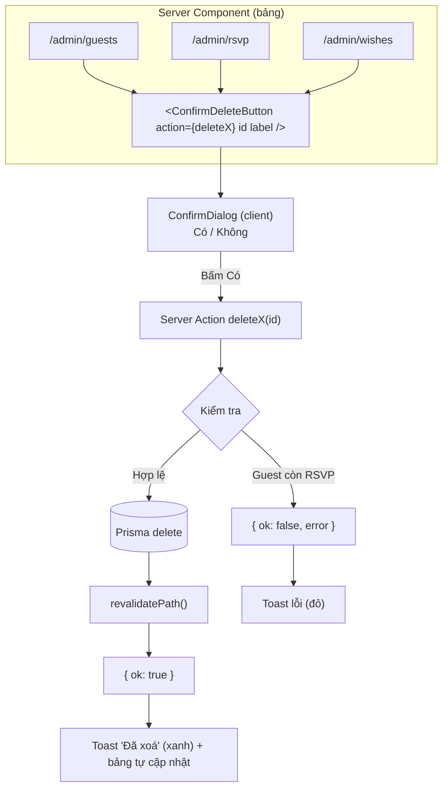

# Design: Xoá bản ghi trong trang admin

> Trạng thái: 🟡 Đang soạn | ✅ Đã duyệt

## Cách tiếp cận tổng thể

Tái sử dụng pattern đã có trong dự án: **Server Action + `revalidatePath`** (giống `toggleWish` ở [app/admin/wishes/page.tsx](app/admin/wishes/page.tsx) và `createInviteLink` ở [app/admin/tao-thiep/actions.ts](app/admin/tao-thiep/actions.ts)). Không tạo API route mới → không có endpoint xoá công khai.

Ba bảng dùng chung **một** component nút xoá, khác nhau ở Server Action truyền vào:



**Vấn đề toast:** sau khi xoá thành công, dòng biến mất → `ConfirmDeleteButton` bị unmount → toast đặt bên trong nó cũng biến mất ngay. Giải pháp: đặt toast ở **context provider trong `app/admin/layout.tsx`** để nó sống độc lập với các dòng trong bảng.

## File / Module thay đổi

| File | Hành động | Mô tả |
|------|-----------|-------|
| [app/admin/actions.ts](app/admin/actions.ts) | Tạo mới | 3 Server Action: `deleteGuest`, `deleteRsvp`, `deleteWish` |
| [components/common/AdminToastProvider.tsx](components/common/AdminToastProvider.tsx) | Tạo mới | Context + hook `useAdminToast()`, render toast ở góc màn hình, tự ẩn sau 3s |
| [components/common/ConfirmDialog.tsx](components/common/ConfirmDialog.tsx) | Tạo mới | Popup tông slate, 2 nút **Có / Không**, đóng bằng `Esc` và click backdrop |
| [components/common/ConfirmDeleteButton.tsx](components/common/ConfirmDeleteButton.tsx) | Tạo mới | Nút Xoá đỏ + mở `ConfirmDialog` + gọi action + bắn toast |
| [app/admin/layout.tsx](app/admin/layout.tsx) | Sửa | Bọc `children` trong `AdminToastProvider` |
| [app/admin/guests/page.tsx](app/admin/guests/page.tsx) | Sửa | Thêm cột **Thao tác** |
| [app/admin/rsvp/page.tsx](app/admin/rsvp/page.tsx) | Sửa | Thêm cột **ID** và cột **Thao tác** |
| [app/admin/wishes/page.tsx](app/admin/wishes/page.tsx) | Sửa | Thêm nút Xoá cạnh nút Duyệt/Ẩn sẵn có |

**Không đụng tới:** [prisma/schema.prisma](prisma/schema.prisma) (chọn phương án chặn nên không cần `onDelete`), [components/ui/Modal.tsx](components/ui/Modal.tsx) (giữ nguyên cho trang thiệp), [middleware.ts](middleware.ts).

## Thay đổi Interface / API / Schema

### Schema DB
Không thay đổi.

### Server Actions (`app/admin/actions.ts`)

```ts
export type DeleteResult = { ok: true } | { ok: false; error: string };

export async function deleteGuest(id: string): Promise<DeleteResult>;
export async function deleteRsvp(id: string): Promise<DeleteResult>;
export async function deleteWish(id: string): Promise<DeleteResult>;
```

| Action | Kiểm tra trước khi xoá | `revalidatePath` |
|--------|------------------------|------------------|
| `deleteGuest` | `id` không rỗng | `/admin/guests`, `/admin/rsvp`, `/admin/wishes` |
| `deleteRsvp` | `id` không rỗng | `/admin/rsvp`, `/admin/wishes`, `/admin/guests` |
| `deleteWish` | `id` không rỗng | `/admin/wishes` |

`deleteGuest` xoá RSVP liên kết trước rồi mới xoá `Guest`, gói trong `db.$transaction` để không để lại dữ liệu nửa vời nếu lỗi giữa chừng. `deleteRsvp` phải revalidate cả 3 trang vì bảng Lời chúc có ghép dữ liệu RSVP theo tên, còn bảng Khách mời hiển thị cột Trạng thái RSVP.

Thông báo lỗi:

| Tình huống | Thông báo |
|-----------|-----------|
| `id` rỗng | `Thiếu ID bản ghi` |
| Prisma `P2025` (không tìm thấy) | `Bản ghi không còn tồn tại` |
| Lỗi khác | `Không xoá được, vui lòng thử lại` |

### Component interface

```ts
// ConfirmDeleteButton
type Props = {
  id: string;
  label: string;                                  // tên/nội dung hiện trong popup
  action: (id: string) => Promise<DeleteResult>;  // Server Action truyền từ Server Component
};

// ConfirmDialog
type Props = {
  open: boolean;
  title: string;
  description: ReactNode;
  confirmLabel?: string;   // mặc định "Có"
  cancelLabel?: string;    // mặc định "Không"
  isPending?: boolean;
  onConfirm: () => void;
  onCancel: () => void;
};
```

`label` với lời chúc dài sẽ được cắt còn ~60 ký tự kèm `…` để popup không vỡ layout.

## Rủi ro & Edge case

| Vấn đề | Cách xử lý |
|--------|-----------|
| **Toast biến mất cùng dòng vừa xoá** | Đặt toast ở `AdminToastProvider` trong layout, không đặt trong từng dòng |
| **Xoá khách mời đang có RSVP** | Xoá RSVP liên kết trước trong cùng `db.$transaction`, popup có ghi chú báo trước cho người dùng |
| **Bản ghi đã bị xoá ở tab khác** | Bắt Prisma `P2025` → "Bản ghi không còn tồn tại" |
| **Bấm "Có" nhiều lần** | `isPending` disable nút, đổi nhãn thành "Đang xoá..." |
| **Xoá nhầm, không hoàn tác được** | Popup nêu rõ tên bản ghi + dòng cảnh báo "Thao tác này không thể hoàn tác" |
| **Bàn phím / screen reader** | `role="dialog"`, `aria-modal="true"`, `aria-labelledby`; `Esc` đóng; focus vào nút "Không" khi mở để tránh Enter nhầm vào "Có" |
| **Cuộn nền khi popup mở** | Khoá `document.body.style.overflow` khi `open`, trả lại khi đóng |
| **Server Action không kèm Basic Auth** | Không xảy ra: action POST vào chính URL `/admin/*`, luôn đi qua matcher `/admin/:path*` của middleware |
| **Xoá `Guest` → link đã gửi cho khách chết** | Đúng thiết kế: route `/[guestSlug]` không tìm thấy sẽ hiển thị thiệp chung, HTTP 200 |
| **Lời chúc quá dài làm vỡ popup** | Cắt chuỗi hiển thị trong popup |

---

⛔ **Thiết kế này ổn chưa? Tôi có thể lập danh sách task và bắt đầu code?**
