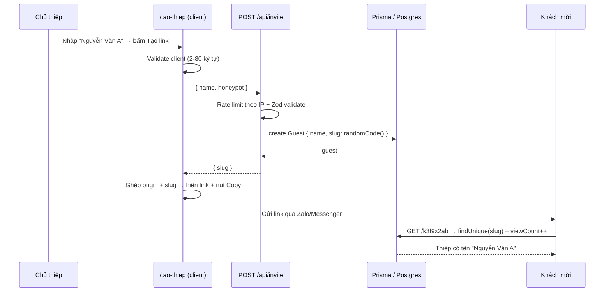

# Design: Tạo link thiệp cá nhân hoá cho khách mời

> Trạng thái: ✅ Đã duyệt — **có sửa sau khi triển khai**

## ⚠️ Thay đổi so với thiết kế ban đầu

Theo yêu cầu mới, trang tạo link **không còn công khai** mà nằm trong `/admin/tao-thiep`:

| Thiết kế ban đầu | Thực tế triển khai |
|-------------------|--------------------|
| Trang công khai `/tao-thiep` | `/admin/tao-thiep` (sau Basic Auth) |
| `POST /api/invite` công khai | Server Action `app/admin/tao-thiep/actions.ts` |
| Rate limit + honeypot chống spam | Bỏ — không còn cần vì đã có Basic Auth |
| Metadata `noindex` | Bỏ — `/admin` vốn không truy cập được |

Lý do dùng Server Action thay vì API route: trình duyệt không chắc chắn gửi kèm header Basic Auth cho `/api/*` (nằm ngoài cây `/admin`), trong khi Server Action POST thẳng vào `/admin/tao-thiep` nên luôn đi qua middleware auth.

Bổ sung ngoài thiết kế: `components/common/AdminNav.tsx` (bôi màu mục menu đang xem) và `components/common/GuestLinkCell.tsx`.

## Cách tiếp cận tổng thể

Tận dụng tối đa hạ tầng sẵn có. Route `/[guestSlug]` đã render thiệp theo tên khách; việc còn thiếu chỉ là **một trang công khai để sinh mã ngẫu nhiên** và **hoàn thiện bảng admin**.

Luồng dữ liệu:



Điểm quan trọng: **không đổi Prisma schema**. Trường `slug` (đã `@unique`) chỉ đổi cách sinh giá trị — từ kebab-case theo tên sang mã ngẫu nhiên. Route động, RSVP prefill, `viewCount` đều hoạt động y nguyên.

## File / Module thay đổi

| File | Hành động | Mô tả |
|------|-----------|-------|
| [lib/invite-code.ts](lib/invite-code.ts) | Tạo mới | `createInviteCode(length = 8)` — sinh mã bằng `crypto.getRandomValues`, alphabet `[a-z0-9]` loại bỏ ký tự dễ nhầm (`0`, `o`, `1`, `l`, `i`) |
| [lib/validations.ts](lib/validations.ts) | Sửa | Thêm `inviteLinkSchema` (`name` 2–80 ký tự, `honeypot` rỗng) |
| [app/api/invite/route.ts](app/api/invite/route.ts) | Tạo mới | `POST` công khai: rate limit → validate → tạo `Guest` với mã ngẫu nhiên (retry khi trùng) → trả `{ slug }` |
| [app/tao-thiep/page.tsx](app/tao-thiep/page.tsx) | Tạo mới | Server Component mỏng, đặt metadata `robots: noindex`, render component client |
| [components/common/InviteLinkGenerator.tsx](components/common/InviteLinkGenerator.tsx) | Tạo mới | Client Component: form 1 ô tên, gọi API, hiển thị danh sách link đã tạo trong phiên |
| [components/common/CopyLinkButton.tsx](components/common/CopyLinkButton.tsx) | Tạo mới | Client Component dùng chung: copy link vào clipboard + phản hồi "Đã sao chép", có fallback |
| [app/admin/guests/page.tsx](app/admin/guests/page.tsx) | Sửa | `include: { rsvp: true }`, thêm cột Link (kèm Copy), Trạng thái RSVP, Số ghế xác nhận, Ngày tạo |
| [components/sections/Footer.tsx](components/sections/Footer.tsx) | *Không đổi* | Không thêm link tới `/tao-thiep` để khách mời không thấy trang này |

**Không đụng tới:** [prisma/schema.prisma](prisma/schema.prisma), [app/[guestSlug]/page.tsx](app/[guestSlug]/page.tsx), [app/api/guests/route.ts](app/api/guests/route.ts), [lib/slug.ts](lib/slug.ts), [middleware.ts](middleware.ts).

## Thay đổi Interface / API / Schema

### Schema DB
Không thay đổi. `Guest.slug` giờ chứa mã dạng `k3f9x2ab` thay vì `nguyen-van-a`. Dữ liệu cũ (slug theo tên) vẫn chạy bình thường vì route chỉ `findUnique` theo chuỗi.

### `POST /api/invite` (công khai, mới)

Request:
```json
{ "name": "Nguyễn Văn A", "honeypot": "" }
```

Response `201`:
```json
{ "slug": "k3f9x2ab" }
```

| Mã lỗi | Trường hợp | Body |
|--------|-----------|------|
| `400` | Tên không hợp lệ / honeypot có giá trị | `{ "error": "Tên khách mời không hợp lệ" }` |
| `429` | Quá 10 lần/phút từ 1 IP | `{ "error": "Bạn thao tác quá nhanh, vui lòng thử lại sau ít phút" }` |
| `500` | Retry sinh mã thất bại 5 lần | `{ "error": "Không tạo được link, vui lòng thử lại" }` |

Endpoint **chỉ có method `POST`** — không hỗ trợ `GET`/`LIST`, nên người lạ không đọc được danh sách khách mời.

### Sinh mã (`lib/invite-code.ts`)

```ts
const ALPHABET = "abcdefghjkmnpqrstuvwxyz23456789"; // 31 ký tự, bỏ 0/o/1/l/i
export function createInviteCode(length = 8): string
```

Không gian mã: $31^8 \approx 8.5 \times 10^{11}$. Với vài trăm khách mời, xác suất trùng gần bằng 0; vẫn giữ retry để chắc chắn.

### Trạng thái RSVP trong bảng admin

| `rsvp` | Hiển thị | Màu |
|--------|----------|-----|
| `null` | Chưa phản hồi | xám |
| `attending: true` | Sẽ tham dự (n ghế) | xanh |
| `attending: false` | Không tham dự | đỏ |

## Rủi ro & Edge case

| Vấn đề | Cách xử lý |
|--------|-----------|
| **Trang công khai bị spam tạo bản ghi rác** | Rate limit 10 req/phút theo IP (tái dùng [lib/rate-limit.ts](lib/rate-limit.ts)) + honeypot ẩn. Chấp nhận rủi ro còn lại vì đây là yêu cầu rõ ràng của chủ thiệp |
| **Rate limit in-memory không hiệu quả trên serverless nhiều instance** | Đã là nợ kỹ thuật sẵn có; giữ nguyên pattern để đồng nhất, ghi nhận trong spec |
| **Mã ngẫu nhiên trùng slug đã tồn tại** | Bắt lỗi Prisma `P2002`, retry tối đa 5 lần, sau đó trả 500 |
| **Mã ngẫu nhiên trùng route tĩnh** (`admin`, `api`, `tao-thiep`) | Bất khả thi: mã dài 8 ký tự chỉ gồm `[a-z2-9]`, các route tĩnh đều khác độ dài/ký tự. Ngoài ra Next.js ưu tiên route tĩnh hơn route động |
| **XSS qua tên khách mời** | Render qua JSX (React tự escape), không dùng `dangerouslySetInnerHTML` |
| **Clipboard API không khả dụng** (HTTP non-localhost, iOS cũ) | Bọc `navigator.clipboard?.writeText` trong `try/catch`; luôn hiển thị link dạng text `<input readonly>` để copy tay |
| **Người dùng bấm "Tạo link" nhiều lần liên tiếp** | Disable nút khi `isSubmitting`, tránh tạo trùng bản ghi |
| **Tên chỉ chứa khoảng trắng** | `.trim()` trước khi validate ở cả client và server |
| **Link cũ theo tên (`/nguyen-van-a`) đã gửi đi** | Vẫn hoạt động — không xoá dữ liệu cũ, không đổi logic route |
| **Trang `/tao-thiep` bị Google index** | Đặt `metadata.robots = { index: false, follow: false }` |
| **Mất kết nối DB khi tạo link** | `try/catch` quanh Prisma, trả 500 kèm thông báo tiếng Việt, client hiện Toast lỗi |

## Ghi chú triển khai

- Trang `/tao-thiep` dùng chung theme Tailwind (`cream`, `primary`, `gold`) và các component [components/ui/Button.tsx](components/ui/Button.tsx), [components/ui/Input.tsx](components/ui/Input.tsx), [components/ui/Toast.tsx](components/ui/Toast.tsx) sẵn có.
- Danh sách link đã tạo lưu trong React state (`useState`), mất khi reload — chủ thiệp vẫn xem lại đầy đủ ở `/admin/guests`.
- Ghép link bằng `window.location.origin` trong `useEffect` để tránh lệch hydration giữa server và client.

---

⛔ **Thiết kế này ổn chưa? Tôi có thể lập danh sách task và bắt đầu code?**
