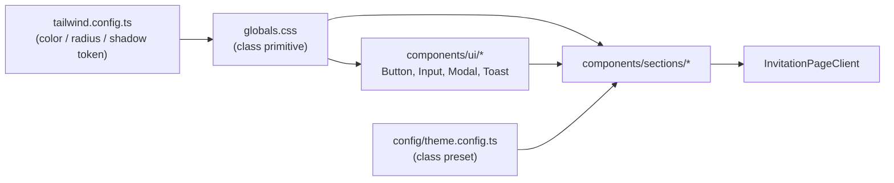

# Design: Redesign giao diện thiệp — phong cách trẻ trung, mượt mà

> Trạng thái: � Đã chốt sau phản hồi — chờ duyệt lần cuối để sang Tasks

## 0. Ghi chú về Pha 1 (Requirements)

Thư mục `.specs/ui-redesign-modern/` chưa có `requirements.md`. Các lựa chọn dưới đây được chốt trực tiếp trong hội thoại và đóng vai trò yêu cầu đầu vào:

| Câu hỏi | Lựa chọn đã chốt |
|---------|------------------|
| Bảng màu | **Đổi hẳn sang pastel hiện đại** (sage / blush / kem, phong cách minimal Hàn Quốc) — ✅ đã xác nhận hợp lý |
| Phạm vi | **Design system + viết lại layout các section** |
| Hiệu ứng | **Giữ pháo hoa, cánh hoa rơi, tự động cuộn** — ✅ đã xác nhận không xoá; chỉ đổi màu cho khớp bảng màu mới |
| Nhạc nền | **Giữ `EnvelopeCover` để nhạc tự phát sau gesture "Mở thiệp"**, khách có thể bấm nút loa để tắt |

Giả định bổ sung (cần bạn xác nhận):
- Giữ nguyên toàn bộ **nội dung** và **chức năng** hiện có (RSVP, lời chúc, calendar, QR mừng cưới, nhạc nền, link theo `[guestSlug]`). Đây thuần tuý là thay đổi UI.
- Không đổi API, không đổi Prisma schema, không đổi `config/site.config.ts` (chỉ đọc).
- Trang `/admin/*` **không** nằm trong phạm vi redesign.
- Vẫn giữ mobile-first, khung tối đa `max-w-xl`.

---

## 1. Cách tiếp cận tổng thể

Redesign theo hướng **token-driven**: định nghĩa lại một bộ design token duy nhất ở `tailwind.config.ts` + `styles/globals.css`, rồi viết lại từng section dựa trên bộ token và một tập primitive dùng chung. Mục tiêu là mọi thay đổi màu/bo góc/khoảng cách về sau chỉ sửa ở một chỗ.

### 1.1. Ba trụ cột của diện mạo mới

**a) Bảng màu pastel** — thay palette burgundy/gold bằng tông sage + blush trên nền kem sáng:

| Token | Giá trị | Dùng cho |
|-------|---------|----------|
| `canvas` | `#FBF9F6` | Nền trang |
| `surface` | `#FFFFFF` | Nền thẻ / card |
| `surface-sunk` | `#F4EFE9` | Nền chìm, ô input, khối phụ |
| `sage` | `#93A98F` | Màu thương hiệu chính, nút, icon |
| `sage-deep` | `#6D8570` | Hover, chữ nhấn trên nền sáng |
| `sage-soft` | `#E4EBE2` | Nền nhạt, chip, viền mềm |
| `blush` | `#EDC9C3` | Điểm nhấn phụ, trái tim, badge |
| `blush-soft` | `#FAEDEA` | Nền nhấn phụ |
| `ink` | `#3B3733` | Chữ chính |
| `ink-muted` | `#8A827A` | Chữ phụ, caption |
| `line` | `#E8E1D8` | Viền 1px |

**Quan trọng:** các key màu cũ (`primary`, `cream`, `gold`, `ink`, `soft`, `ivory`, `secondary`) **được giữ lại làm alias** trỏ về giá trị mới, để `components/ui/*` và mọi chỗ chưa kịp sửa không bị vỡ trong lúc chuyển đổi. Sau khi refactor xong hết section, các alias sẽ được gỡ ở task cuối.

**b) Ngôn ngữ hình khối mềm** — thay “vintage frame” (viền đôi 2px, góc vuông, khung hoa văn) bằng:
- Bo góc lớn: `rounded-2xl` (card) / `rounded-full` (nút, chip, avatar).
- Viền `1px` màu `line` thay cho `border-2`.
- Đổ bóng rất nhẹ: `shadow-soft` = `0 1px 2px rgba(59,55,51,.04), 0 8px 24px -12px rgba(59,55,51,.10)`.
- Bỏ toàn bộ `::before` viền lồng, hoa văn góc (`floral-*`), `vintage-frame`, `polaroid`, `gold-divider`.

**c) Nhịp chữ & khoảng cách** — thang đo thống nhất:
- Sans (Be Vietnam Pro) làm chữ chủ đạo, weight 400/500; bỏ `uppercase tracking-[0.3em]` dày đặc, chỉ dùng cho eyebrow label nhỏ.
- Serif (Playfair Display) chỉ dùng cho tiêu đề section và ngày cưới.
- Script (Great Vibes) **chỉ** dùng cho tên cô dâu/chú rể ở Hero — không dùng nơi khác.
- Nhịp section: `py-14 px-5`, tiêu đề → divider mảnh → nội dung, khoảng cách nội bộ `space-y-4`.

### 1.2. Chính sách chuyển động (motion)

Chỉ còn **một** loại chuyển động trên trang thiệp: fade + slide-up khi phần tử vào viewport.

| Thành phần | Quyết định |
|-----------|------------|
| `RevealOnScroll` | **Giữ**, chuẩn hoá về `duration 0.5s`, `distance 16px`, `ease [0.22,1,0.36,1]`, `once: true` |
| `Stagger` | **Giữ**, `stagger` chuẩn `0.06s` |
| `Fireworks` + `useFireworks` | **Giữ nguyên hành vi** (bắn pháo hoa khi mở thiệp), chỉ đổi bảng màu hạt pháo hoa từ burgundy/gold/cream sang sage/blush/canvas cho khớp theme mới |
| `FallingPetals` | **Giữ nguyên hành vi**, đổi màu cánh hoa từ tông đỏ/gold sang tông blush/sage nhạt |
| `useAutoScroll` (tự cuộn sau khi mở thiệp) | **Giữ nguyên**, không đổi |
| `EnvelopeCover` | **Giữ nhưng đơn giản hoá phần khung/viền**: bỏ viền vintage 3D góc cạnh, thay bằng thẻ bo góc mềm theo token mới, vẫn giữ animation lật mở phong bì làm user gesture để trình duyệt cho phép phát nhạc nền |
| `MusicPlayer` | **Giữ**, chỉ đổi lại giao diện nút theo token mới; khách bấm nút để tắt nhạc khi đang phát |
| Keyframes `envelope-open` | **Giữ**, đổi màu liên quan nếu cần |
| Keyframes `float` / `shimmer` | **Xoá** nếu không còn nơi nào dùng sau khi rà soát (giữ lại nếu `Fireworks`/`FallingPetals` có phụ thuộc) |
| `prefers-reduced-motion` | **Giữ nguyên** hành vi: chỉ fade, không slide (áp dụng cho `RevealOnScroll`; `Fireworks`/`FallingPetals`/auto-scroll vẫn giữ như hiện tại vì đã được người dùng xác nhận giữ) |

### 1.3. Luồng dữ liệu

Không đổi. `app/page.tsx` và `app/[guestSlug]/page.tsx` (Server Component) vẫn đọc Prisma rồi truyền `guestName` / `guestSlug` xuống `InvitationPageClient`. Các section vẫn đọc nội dung từ `config/site.config.ts`. RSVP/Wishes vẫn gọi `/api/rsvp`, `/api/wishes`.

---

## 2. File / Module thay đổi

### 2.1. Nền tảng design system

| File | Hành động | Mô tả |
|------|---------|--------|
| [tailwind.config.ts](tailwind.config.ts) | Sửa | Thay palette bằng token pastel mới + alias tương thích ngược; thêm `borderRadius.xl2`, `boxShadow.soft/lift`; giữ keyframes `envelope-open` (cho `EnvelopeCover`); xoá `backgroundImage` vintage (không còn dùng hoa văn góc) |
| [styles/globals.css](styles/globals.css) | Sửa (viết lại phần lớn) | Xoá `.vintage-frame`, `.floral-*`, `.polaroid`, `.gold-divider`, `.btn-vintage*`, `.input-vintage`, `.card-burgundy`. Giữ `@keyframes fall` (dùng cho `FallingPetals`). Thêm primitive mới: `.section`, `.section-title`, `.section-eyebrow`, `.card`, `.card-sunk`, `.divider`, `.chip`, `.field` |
| [config/theme.config.ts](config/theme.config.ts) | Sửa | Thay preset class cũ bằng preset mới (`section`, `card`, `cardAccent`, `accent`) |
| [app/layout.tsx](app/layout.tsx) | Sửa | `body` đổi sang `bg-canvas text-ink antialiased`; giữ nguyên 3 font |

### 2.2. Component UI dùng chung

| File | Hành động | Mô tả |
|------|---------|--------|
| [components/ui/Button.tsx](components/ui/Button.tsx) | Sửa | Variant `primary` (sage đặc, bo tròn), `outline` (viền mảnh), thêm `ghost`; bỏ `uppercase tracking-wider`, thêm trạng thái `:active` scale nhẹ và `:disabled` |
| [components/ui/Input.tsx](components/ui/Input.tsx) | Sửa | Nền `surface-sunk`, viền 1px `line`, `rounded-xl`, focus ring `sage/25` |
| [components/ui/Modal.tsx](components/ui/Modal.tsx) | Sửa | Bo góc lớn, backdrop `ink/40 backdrop-blur-sm`, nút đóng tròn |
| [components/ui/Toast.tsx](components/ui/Toast.tsx) | Sửa | Đổi màu theo token mới, bo tròn |
| [components/ui/Skeleton.tsx](components/ui/Skeleton.tsx) | Sửa | Bỏ `animate-shimmer`, dùng `animate-pulse` mặc định của Tailwind |

### 2.3. Chuyển động

| File | Hành động | Mô tả |
|------|---------|--------|
| [components/common/RevealOnScroll.tsx](components/common/RevealOnScroll.tsx) | Sửa | Chuẩn hoá default: `duration 0.5`, `distance 16`, `amount 0.2`; bỏ prop `scale` |
| [components/common/Stagger.tsx](components/common/Stagger.tsx) | Sửa | Chuẩn hoá `stagger` mặc định `0.06`, đồng bộ easing với `RevealOnScroll` |
| [components/common/EnvelopeCover.tsx](components/common/EnvelopeCover.tsx) | Sửa | Đổi màu/khung theo token mới (bo góc mềm thay viền vintage), giữ nguyên animation lật mở + giữ vai trò user gesture để nhạc tự phát |
| [components/common/MusicPlayer.tsx](components/common/MusicPlayer.tsx) | Sửa | Nút tròn nổi, `backdrop-blur`, màu token mới; giữ chức năng bấm để tắt nhạc |
| [components/common/Fireworks.tsx](components/common/Fireworks.tsx) | Sửa | Giữ logic bắn pháo hoa khi mở thiệp; đổi bảng màu hạt sang sage/blush/canvas |
| [components/common/FallingPetals.tsx](components/common/FallingPetals.tsx) | Sửa | Giữ hiệu ứng cánh hoa rơi; đổi màu/hình cánh hoa sang tông blush/sage nhạt |
| [hooks/useFireworks.ts](hooks/useFireworks.ts) | Sửa | Đổi mảng màu pháo hoa sang token mới, giữ nguyên logic |
| [hooks/useAutoScroll.ts](hooks/useAutoScroll.ts) | Giữ nguyên | Không đổi |

### 2.4. Các section (viết lại layout)

| File | Hành động | Hướng layout mới |
|------|---------|------------------|
| [components/InvitationPageClient.tsx](components/InvitationPageClient.tsx) | Sửa | Giữ `Fireworks`, `FallingPetals`, `useAutoScroll` như hiện tại; đổi nền sang `bg-canvas`; bọc mỗi section bằng `RevealOnScroll` đồng nhất |
| [components/sections/Hero.tsx](components/sections/Hero.tsx) | Sửa | Ảnh cưới full-bleed cao ~`70vh` + lớp phủ gradient nhẹ; tên script lớn ở dưới, eyebrow "Save the date", ngày cưới. Bỏ 4 ảnh hoa văn góc và khung viền vàng |
| [components/sections/Calendar.tsx](components/sections/Calendar.tsx) | Sửa | Lưới lịch trên card trắng bo góc, ngày cưới là chấm tròn sage đặc |
| [components/sections/Countdown.tsx](components/sections/Countdown.tsx) | Sửa | 4 ô vuông bo góc nền `sage-soft`, số lớn, nhãn nhỏ `ink-muted` |
| [components/sections/Invitation.tsx](components/sections/Invitation.tsx) | Sửa | Căn giữa, tên khách mời trong chip bo tròn `blush-soft` |
| [components/sections/Program.tsx](components/sections/Program.tsx) | Sửa | Timeline dọc đường mảnh `line`, chấm tròn sage, thẻ nội dung nền trắng |
| [components/sections/EventInfo.tsx](components/sections/EventInfo.tsx) | Sửa | Card trắng bo góc + icon tròn `sage-soft`; bỏ phân biệt viền đậm/nhạt giữa 2 sự kiện |
| [components/sections/LocationMap.tsx](components/sections/LocationMap.tsx) | Sửa | Bản đồ bo góc `overflow-hidden`, nút chỉ đường dạng pill |
| [components/sections/LoveStory.tsx](components/sections/LoveStory.tsx) | Sửa | Timeline xen kẽ ảnh/chữ, ảnh bo góc; bỏ badge vuông |
| [components/sections/Gallery.tsx](components/sections/Gallery.tsx) | Sửa | Lưới masonry 2 cột, ảnh `rounded-xl`; bỏ khung polaroid nghiêng; ảnh mở bằng `Modal` |
| [components/sections/RsvpForm.tsx](components/sections/RsvpForm.tsx) | Sửa | Form trên nền sáng (bỏ nền burgundy), 2 lựa chọn tham dự dạng thẻ chọn bo tròn |
| [components/sections/Wishes.tsx](components/sections/Wishes.tsx) | Sửa | Ô nhập bo góc + danh sách lời chúc dạng bong bóng nền `surface-sunk` |
| [components/sections/GiftBox.tsx](components/sections/GiftBox.tsx) | Sửa | Card QR bo góc, nút sao chép số tài khoản dạng pill |
| [components/sections/Footer.tsx](components/sections/Footer.tsx) | Sửa | Tối giản: tên + lời cảm ơn + ngày, chữ `ink-muted` |
| [components/sections/DressCode.tsx](components/sections/DressCode.tsx) | Sửa | Đồng bộ token (component đang bị comment-out, vẫn cập nhật để không lệch style) |

### 2.5. Tài nguyên tĩnh

| File | Hành động | Mô tả |
|------|---------|--------|
| `public/images/decorations/floral-corner.svg`, `pattern.svg` | Giữ nguyên file, ngừng tham chiếu | Không xoá để tránh vỡ nếu muốn quay lại |

---

## 3. Thay đổi Interface / API / Schema

- **API:** không đổi. `/api/rsvp`, `/api/wishes`, `/api/calendar`, `/api/guests` giữ nguyên request/response.
- **Database:** không đổi `prisma/schema.prisma`.
- **`config/site.config.ts`:** không đổi cấu trúc dữ liệu.
- **Props component (breaking nội bộ):**
  - `RevealOnScroll`: bỏ prop `scale` (hiện chỉ dùng ở vài chỗ trong `Gallery`/`LoveStory` — sẽ sửa kèm).
  - `Button`: thêm variant `ghost`; các variant cũ giữ nguyên tên.
  - `EnvelopeCover`: giữ nguyên signature `{ opened, onOpen, onRevealed }` để `InvitationPageClient` không phải đổi cách gọi.
- **Token Tailwind:** tên màu cũ vẫn còn (alias) trong suốt quá trình refactor, gỡ ở task cuối cùng.

---

## 4. Rủi ro & Edge case

| Rủi ro / Edge case | Cách xử lý |
|---|---|
| Đổi giá trị token làm vỡ style ở nơi chưa refactor (đặc biệt `components/ui/*` dùng chung với trang admin: `Button`, `Input`, `Toast`, `Modal`, `ConfirmDialog`) | Giữ alias màu cũ trỏ về giá trị mới trong suốt quá trình; kiểm tra thủ công `/admin/guests`, `/admin/rsvp`, `/admin/wishes`, `/admin/tao-thiep` ở task cuối |
| Màu pháo hoa/cánh hoa cũ (burgundy/gold/cream) lạc tông với nền pastel mới | Cập nhật mảng màu trong `useFireworks.ts`, `Fireworks.tsx`, `FallingPetals.tsx` sang sage/blush/canvas, không đổi logic/timing |
| Nhạc nền không tự phát nếu mất user gesture | Giữ nguyên `EnvelopeCover` với hành động mở phong bì làm gesture; nếu `play()` bị reject thì `MusicPlayer` fallback về trạng thái tắt tiếng, khách bấm nút loa để bật/tắt |
| Tương phản chữ trên nền pastel không đạt WCAG AA | Chữ chính dùng `ink` (#3B3733) trên `canvas`/`surface` → tỉ lệ > 10:1. Không đặt `ink-muted` lên nền `sage`. Chữ trắng chỉ đặt trên `sage-deep` |
| Ảnh Hero full-bleed gây layout shift / tải chậm trên 3G | Dùng `next/image` với `priority`, `sizes`, `placeholder="blur"`, khung có `aspect-ratio` cố định |
| Masonry 2 cột với ảnh chưa có kích thước → nhảy layout | Dùng `columns-2` CSS + `aspect-[3/4]` cho mỗi ô ảnh |
| Khách bật "giảm chuyển động" | `RevealOnScroll` đọc `useReducedMotion()`, chỉ fade. `Fireworks`/`FallingPetals`/auto-scroll giữ nguyên hành vi hiện tại theo yêu cầu người dùng (không thêm kiểm tra reduced-motion mới ngoài phạm vi đã có) |
| Ảnh placeholder trong `public/images/*` chưa có ảnh thật → Hero mới trống trải | Fallback: nếu không có ảnh, Hero hiển thị nền `sage-soft` với tên script (kiểm tra bằng biến trong `site.config.ts`) |
| Redesign 14 section trong một lần commit khó review / khó rollback | Chia task theo nhóm (nền tảng → ui → motion → nhóm section), mỗi task build xanh mới sang task kế |
| Trang chưa có `error.tsx` / `not-found.tsx` (nợ kỹ thuật đã ghi trong codebase-analysis) | **Ngoài phạm vi** lần này, chỉ ghi nhận |

---

## 5. Cách kiểm thử (dự kiến)

Dự án chưa có test framework, nên xác minh bằng kiểm tra thủ công:

1. `npm run lint` và `npm run build` xanh sau mỗi task.
2. Xem `/` và `/<guestSlug>` ở khung 390×844 (mobile) và 1280×800 (desktop).
3. Gửi thử RSVP + lời chúc, kiểm tra dữ liệu vào DB.
4. Bật `prefers-reduced-motion` trong DevTools, xác nhận không còn slide.
5. Mở `/admin/*` xác nhận không bị vỡ giao diện.
6. Kiểm tra Lighthouse mobile: không có layout shift lớn ở Hero.

---

## ✅ Đã xác nhận

1. Bảng màu sage `#93A98F` + blush `#EDC9C3` trên nền kem `#FBF9F6` — **hợp lý**.
2. Giữ `EnvelopeCover` để nhạc nền tự phát sau gesture mở thiệp; khách bấm nút để tắt.
3. **Không xoá** hiệu ứng pháo hoa + cánh hoa rơi + tự động cuộn — giữ nguyên, chỉ đổi màu cho khớp theme pastel mới.

Bạn duyệt thiết kế này để tôi lập `tasks.md` và bắt đầu code?
